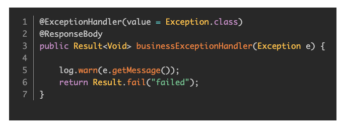

# Code
Code Tool for Editor.js 2.0 with language selector、theme selector compatible with PrismJs Language Codes



## Feature
- Line Number ✌️
- theme selector
- language selector

## Usage

Add a new Tool to the `tools` property of the Editor.js initial config.

```
npm i @7polo/editorjs-code
```

```javascript
var editor = EditorJS({
  ...
  tools: {
    ...
    code: {
        class: Code,
        config: {
            plugins:{ // PrismJs block-editor-plugins
              'autolinker': {
                        css: `https://cdn.jsdelivr.net/npm/prismjs@1.25.0/plugins/autolinker/prism-autolinker.css`,
                        js: `https://cdn.jsdelivr.net/npm/prismjs@1.25.0/plugins/autolinker/prism-autolinker.min.js`
              }
            }
        }
    }
  }
});
```

## Config Params
no configuration yet!

## Output data

This Tool returns code.

```json
{
    "type" : "code",
    "data" : {
        "code": "body {\n font-size: 14px;\n line-height: 16px;\n}",
        "language": "css",
        "theme": "tomorrow"
    }
}
```


